# Data Model — logical graph

> Generated from `docs/data_model.yml` (SSOT) — do not hand-edit the region
> below. Edit the yaml and run `python scripts/check_data_model.py --render`.
>
> Node shapes: `[dim]` = direct-join dimension, `[(fact)]` = fact table,
> `{{resolver}}` = a bridge/crosswalk table (dashed `-.via <name>.->` edges
> route through it instead of joining the target directly).

```mermaid
graph LR
    dim_nfl_players[dim_nfl_players]
    dim_rookie_prospect[dim_rookie_prospect]
    dim_position[dim_position]
    dim_school[dim_school]
    dim_contract[dim_contract]
    dim_fantasy_teams[dim_fantasy_teams]
    dim_nfl_teams[dim_nfl_teams]
    dim_dynasty_metric[dim_dynasty_metric]
    dim_pick_value_curve[dim_pick_value_curve]
    fact_draft_pick[(fact_draft_pick)]
    fact_draft_pick_future[(fact_draft_pick_future)]
    dim_season[dim_season]
    dim_division[dim_division]
    dim_fantrax_crosswalk{{dim_fantrax_crosswalk}}
    dim_dynasty_crosswalk{{dim_dynasty_crosswalk}}
    dim_player_alias{{dim_player_alias}}
    dim_roster_asset{{dim_roster_asset}}
    fact_nfl_combine_pro_day_metrics[(fact_nfl_combine_pro_day_metrics)]
    fact_fantasy_teams[(fact_fantasy_teams)]
    fact_roster_transactions[(fact_roster_transactions)]
    fact_roster_placement[(fact_roster_placement)]
    fact_minor_eligibility[(fact_minor_eligibility)]
    fact_rookie_rankings[(fact_rookie_rankings)]
    fact_fantrax_adp[(fact_fantrax_adp)]
    fact_dynasty_ranking_metrics[(fact_dynasty_ranking_metrics)]
    dim_nfl_players --> dim_nfl_teams
    dim_rookie_prospect --> dim_school
    dim_rookie_prospect --> dim_position
    dim_fantasy_teams --> dim_division
    fact_draft_pick --> dim_season
    fact_draft_pick --> dim_fantasy_teams
    fact_draft_pick_future --> dim_season
    fact_draft_pick_future --> dim_fantasy_teams
    dim_division --> dim_season
    dim_fantrax_crosswalk --> dim_nfl_players
    dim_fantrax_crosswalk --> dim_rookie_prospect
    dim_dynasty_crosswalk --> dim_nfl_players
    dim_dynasty_crosswalk --> dim_rookie_prospect
    dim_player_alias --> dim_rookie_prospect
    dim_roster_asset --> dim_fantrax_crosswalk
    dim_roster_asset --> dim_nfl_players
    dim_roster_asset --> dim_rookie_prospect
    dim_roster_asset --> fact_draft_pick
    fact_nfl_combine_pro_day_metrics --> dim_nfl_players
    fact_nfl_combine_pro_day_metrics --> dim_rookie_prospect
    fact_fantasy_teams --> dim_fantasy_teams
    fact_fantasy_teams --> dim_nfl_players
    fact_fantasy_teams --> dim_rookie_prospect
    fact_fantasy_teams --> dim_contract
    fact_roster_transactions --> dim_fantasy_teams
    fact_roster_transactions --> dim_roster_asset
    fact_roster_transactions --> dim_season
    fact_roster_transactions --> dim_contract
    fact_roster_transactions --> dim_nfl_players
    fact_roster_transactions -.via dim_fantrax_crosswalk.-> dim_nfl_players
    fact_roster_placement --> dim_fantasy_teams
    fact_roster_placement -.via dim_fantrax_crosswalk.-> dim_nfl_players
    fact_roster_placement -.via dim_fantrax_crosswalk.-> dim_rookie_prospect
    fact_minor_eligibility -.via dim_fantrax_crosswalk.-> dim_nfl_players
    fact_rookie_rankings --> dim_rookie_prospect
    fact_rookie_rankings --> dim_nfl_players
    fact_fantrax_adp --> dim_fantrax_crosswalk
    fact_fantrax_adp -.via dim_fantrax_crosswalk.-> dim_nfl_players
    fact_fantrax_adp -.via dim_fantrax_crosswalk.-> dim_rookie_prospect
    fact_dynasty_ranking_metrics --> dim_nfl_players
    fact_dynasty_ranking_metrics -.via dim_dynasty_crosswalk.-> dim_rookie_prospect
    fact_dynasty_ranking_metrics --> dim_dynasty_metric

    classDef resolver fill:#3b2f4f,stroke:#a78bfa,stroke-width:2px;
    classDef fact fill:#1e3a5f,stroke:#60a5fa,stroke-width:1px;
    classDef dim fill:#1f2937,stroke:#9ca3af,stroke-width:1px;
    class dim_nfl_players dim;
    class dim_rookie_prospect dim;
    class dim_position dim;
    class dim_school dim;
    class dim_contract dim;
    class dim_fantasy_teams dim;
    class dim_nfl_teams dim;
    class dim_dynasty_metric dim;
    class dim_pick_value_curve dim;
    class fact_draft_pick fact;
    class fact_draft_pick_future fact;
    class dim_season dim;
    class dim_division dim;
    class dim_fantrax_crosswalk resolver;
    class dim_dynasty_crosswalk resolver;
    class dim_player_alias resolver;
    class dim_roster_asset resolver;
    class fact_nfl_combine_pro_day_metrics fact;
    class fact_fantasy_teams fact;
    class fact_roster_transactions fact;
    class fact_roster_placement fact;
    class fact_minor_eligibility fact;
    class fact_rookie_rankings fact;
    class fact_fantrax_adp fact;
    class fact_dynasty_ranking_metrics fact;
```

<!-- BEGIN GENERATED data-model-graph — regen: python scripts/check_data_model.py --render -->

<!-- END GENERATED data-model-graph -->

## Full prose detail

See [.claude/memory/data-model.md](../.claude/memory/data-model.md) for grain,
column-level notes, and pipeline history — this file is the graph shape only.
